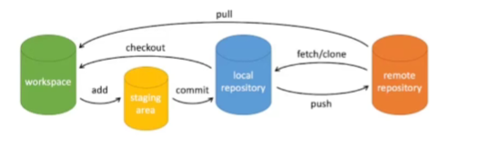

### Git 概念

git 是一个开源的<strong>分布式</strong>版控制系统，Git的操作一般使用命令；

wordspace：工作区

staging area：暂存区/缓存区

local repository：版本库或本地仓库

remote repository：远程仓库

### Git 基本操作

| git clone <仓库地址>                | 拷贝一个Git仓库到本地                                      |
| ----------------------------------- | ---------------------------------------------------------- |
| git branch -a \| -r \| -l           | 用于查看本地和远程仓库全部分支 \| 远程仓库分支 \| 本地分支 |
| git remote add [shortname] [url]    | 添加远程版本库                                             |
| git fetch                           | 用于从远程获取代码                                         |
| git checkout <本地分支名>           | 切换本地分支                                               |
| git pull <本地分支名>               | 用于从远程获取代码并合并本地的版本                         |
| git add .                           | 添加当前目录下的所有文件到暂存区                           |
| git commit -m [message]             | 将暂存区内容添加到本地仓库中                               |
| git push <本地分支名>\|<远程分支名> | 用于从将本地的分支版本上传到远程并合并                     |

### 项目中使用git的场景

1. 自我需求的开发：从远程dev仓库拉取代码至本地；基于dev分支创建本地功能开发分支；开发完成之后；提交至远程仓库（git push origin <远程分支名称>）

2. 分支合并：git merge <分支名称>（当前位于分支A，执行git merge B，意思就是将B分支上的代码合并到A分支，A分支代码发生变化）

3. 合并时出现冲突怎么解决：先沟通，后操作
