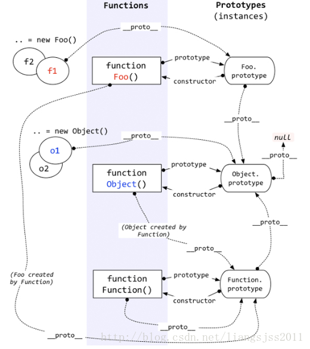

JavaScript当中每个对象都有一个特殊的内置属性,<code>[[prototype]]</code>。几乎所有的对象在创建时<code>[[prototype]]</code>属性都会被赋予一个非空的值。

所有普通的<code>prototype</code>链最终都会指向内置的<code>Object.prototype</code>。由于所有的“普通”（内置，不是特定主机的扩展）对象都“源于”这个<code>Object.prototype</code>对象，所以它包含JavaScript中许多通用的功能。


### 属性设置和屏蔽

给一个对象设置属性，并不仅仅是添加一个新属性或者修改已有的属性。

```jd
var myObject = {}
myObject.foo = 'bar'
```

如果<code>myObject</code>对象中包含名为<code>foo</code>的普通数据访问属性，这条赋值语句只会修改已有的属性值。

如果<code>foo</code>不是直接存在于<code>myObject</code>中，<code>[[prototype]]</code>链就会被遍历，类似<code>[[get]]</code>操作。如果原型链上找不到<code>foo</code>，<code>foo</code>就会被直接添加到<code>myObject</code>上。

然而，如果<code>foo</code>存在于原型链上层，赋值语句<code>myObject.foo = 'bar'</code>的行为就会有些不同。

```js
var obj = {
    name: 'obj'
}

obj.a = 'a'
Object.defineProperty(obj, 'b', {
    value: 'b'
})
obj.__proto__.c = 'c' 
Object.defineProperty(obj.__proto__, 'd', {
    value: 'd',
    // writeable: false // 默认false，故此处省略
})

/*var myObject = {
    name: 'myObject'
}

myObject.__proto__ = obj
*/

var myObject = Object.create(obj, {
    name: { value: 'myObject' }
})

console.log(myObject)

myObject.a = 'a1'
myObject.b = 'b1'
myObject.c = 'c1'
myObject.d = 'd1'

console.log(myObject.a) // 原对象 新增属性
console.log(myObject.b) // 属性值未发生变化
console.log(myObject.c) // 原对象 新增属性
console.log(myObject.d) // 属性值未发生变化
console.log(myObject)
```

只读属性<code>writable:false</code>会阻止<code>[[prototype]]</code>链下层隐式创建同名属性。这样做主要是为了模拟类属性的继承。奇怪的是，这个限制只存在于 = 赋值，使用<code>Object.defineProperty()</code>并不会受到影响。

```js
const myObject = {
  name: 'myObject'
}

// 只读的 foo2
Object.defineProperty(myObject.__proto__, 'foo2', {
  value: 'foo2',
  writable: false
})

// 使用Object.defineProperty
Object.defineProperty(myObject, 'foo2', {
  value: 'bar2',
  configurable: true,
  enumerable: true,
  writable: true
})
console.log(myObject) // {name: 'myObject', foo2: 'bar2'}
console.log(myObject.__proto__) // 存在 foo2属性，属性值为 foo2
```

<em>有些情况下会隐式产生屏蔽：</em>

```js
var antherObject = { a: 2 }
var myObject = Object.create(antherObject)
antherObject.a // 2
myObject.a // 2
antherOnject.hasOwnProperty('a') // true
myObject.hasOwnProperty('a') // false

myObject.a++ // 隐式屏蔽 myObject.a = myObject.a + 1

myObject.hasProperty('a') // true
```


### 类函数

所有的函数都会拥有一个名为<code>prototype</code>的公有并且不可枚举属性，它指向另一个对象：

```js
function Foo(){}

Foo.prototyoe; // {}
```

这个对象通常被称为 Foo 的原型，因为我们通过名为 Foo.prototype 的属性引用来访问它。

这个对象是在调用 new Foo() 时创建的，最后会被关联到这个 “Foo.prototyoe”对象上。

```js
function Foo(){}

var a = new Foo()

Object.getPrototypeOf(a) === Foo.prototype // true
```

调用 new Foo() 时会创建 a，其中一步就是将 a 内部的 [[prototype]] 链接到 Foo.prototype 所指向的对象。

new Foo() 会生成一个新的对象（我们称之为a），这个新对象的内部链接[[prototype]]关联的是Foo.prototype对象。

最后我们得到了两个对象，它们之间相互关联。

实际上，Foo 和程序中的其他函数没有任何区别。函数本身并不是构造函数，然而，当你在普通的函数调用前面加上new关键字之后，就会把这个函数调用变成一个“构造函数调用”。实际上new会劫持所以普通函数并用构造函数的形式来调用它。


### 函数的原型

所有函数默认都会拥有一个名为<code>prototype</code>的公有并且不可枚举的属性，它会指向另一个对象：

```js
function Foo(){
}
Foo.prototype // {}
```

这个对象通常被称为<code>Foo</code>的原型，因为我们通过名为<code>Foo.prototype</code>的属性引用来访问它。

这个对象（Foo.prototype）是在调用<code>new Foo()</code>时创建的，最后会被关联到这个“Foo.prototype”对象上。

```js
function Foo(){
    
}
var a = new Foo()
Object.getPrototypeOf(a) === Foo.prototype // true
```

调用<code>new Foo()</code>时会创建<code>a</code>，其中一步就是将<code>a</code>内部的<code>[[prototyoe]]</code>链接到<code>Foo.prototype</code>所指向的对象。


#### 构造函数原型内存图

```js
function Person(){
    
}
var p1 = new Person()
var p1 = new Person()
console.log(p1.__proto === Person.prototype) // true
console.log(p2.__proto === Person.prototype) // true
```


