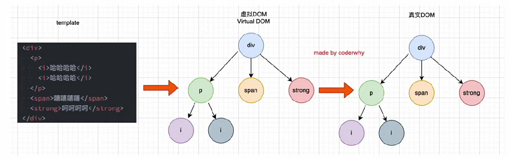

### 官方解释

- 在Vue的<font color='#f00'>虚拟DOM算法</font>，在<font color='#f00'>新旧nodes</font>对比时辨识VNodes；
- 如果不使用key，Vue会使用一种最大限度减少动态元素并且尽可能的尝试就地修改/复用相同类型元素的算法；
- 而使用key，它会基于key的变化重新排列元素顺序，并且销毁key不存在的元素，创建新增的key；

### VNode -- Virtual Node

无论是组件还是元素，它们最终在Vue中表示出来的都是一个个VNode

VNode的本质是一个JavaScript的对象

```html
<div class='title' style='font-size: 30px; color: red;'>
    哈哈哈
</div>
```

```js
const vnode = {
    type: 'div',
    props: {
        class: 'title',
        style: {
            'font-size': '30px',
            color: 'red'
        }
    },
    childred: '哈哈哈'
}
```

#### Vue转换过程

template -- VNode -- 真实DOM

### 虚拟DOM

如果我们不只是一个简单的div，而是有一堆的元素，那么它们应该会形成一个VNode Tree

```html
<div>
    <p>
        <i>哈哈哈</i>
        <i>嘻嘻嘻</i>
    </p>
    <span>呜呜呜</span>
    <strong>嘿嘿嘿</strong>
</div>
```



