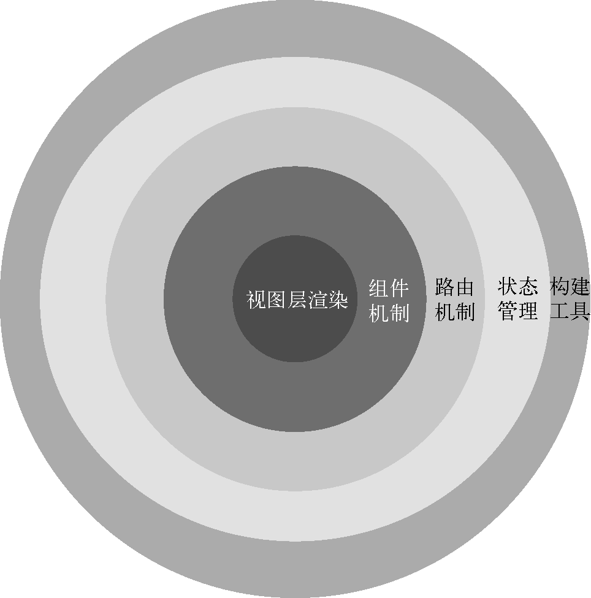

### methods 属性

> 我们不应该使用箭头函数来定义methods函数。
>
> > 箭头函数绑定了父级作用域的上下文`this`将不会按照期望的那样指向组件实例

### 计算属性

### mustache 语法

### 基本指令

- v-once
- v-text
- v-html
- v-pre  用于跳过元素和它的子元素编译过程，显示原始的Mustache 标签（不解析 {{}}内容）
- v-cloak 在模板被解析之前，对模板进行处理（可对元素操作让其不显示，避免出现闪屏）
- v-bind 具体变量 / 对象语法 / 数组语法 / 动态绑定属性名称 :[变量名称的属性值]="变量名称的属性值" / 绑定一个对象（将一个对象的所有属性，绑定到元素上的所有属性） v-bind="一个对象的变量名称"
- v-on  绑定多个事件 v-on="{click: fn1, mousemove: fn2}"
- v-for
- v-if
- v-show

## 框架分层



### 计算属性 computed

对于任何包含响应式的数据的复杂逻辑，都应该使用<font color='#f00'>计算属性</font>；

<font color='#f00'>计算属性</font>将被混入到组件实例中，所有getter和setter的this上下文自动地绑定为组件实例。

#### 计算属性与methods

计算属性会基于它们的依赖关系进行缓存；

在数据不发生变化时，计算属性是不需要重新计算的；

如果依赖的数据发生变化，在使用时，计算属性会重新进行计算，更新数据。

#### 计算属性实现

> 遍历computed内部属性（for...in）
>
> 获取get函数 -- 判断属性是否为函数，若为函数则绑定this，将其赋值给 get；如果该属性不为函数，则判断属性内部的get属性是否为函数，若为函数则绑定this，将其赋值给get，否则赋值为 空函数 () => {}
>
> 获取set函数 -- 若 属性不为函数，且属性内部的set属性为函数，则对其进行this绑定，且赋值；否则判断是否为开发环境，开发环境，控制台警告，生产环境将其赋值为 空函数 () => {}
>
> 调用 computed函数，实现数据缓存，等一系列操作
>
> 数据双向绑定 利用Object.defineProperty()

### 侦听器 watch

用法：

> 选项：watch
>
> 类型：{ [key: string]: string | Functoin | Object | Array }

使用场景：对数据变化之后，进行一些逻辑的处理时（网络请求等），使用侦听器

声明侦听器回调时避免使用箭头函数，因为它们将无法通过 `this` 访问组件实例

```js
data(){
    return {
        question: '',
        anwser: ''
    }
},
watch: {
    // question 侦听的data中的属性的名称
    // newValue 变化后的新值
    // oldValue 变化前的旧值
    question(newValue, oldValue){
        this.queryAnwser()
    }
},
methods: {
    queryAnwser(){
        
    }
}

```

#### 配置选项

	1. handler
	1. immediate：在侦听器创建时立即触发回调。第一次调用时，旧值将为 `undefined`。
	1. deep：如果源是对象或者数组 ，则强制深度遍历源，以便在深度变更时触发回调
	1. flush：调整回调的刷新时机
	1. onTrach / onTrigger：调试侦听器的依赖关系

```jd
data(){
	return {
		info: { name: 'why', age: 12 }
	}
},
watch: {
	/* 
	// 默认情况下，当侦听的数据为对象时，对象内部属性变化无法被侦听
	info(newInfo, oldInfo){
		console.log(newInfo, oldInfo)
	}
	*/
	/* // 配置选项
	info: {
		hander: function(newInfo, oldInfo){
		
		},
		deep: true, // 控制深度侦听
		immediate: true, // 立即执行
	}
	*/
	// 设置多个handler函数
	info: [
        function hander1(){

        },
        function hander2(){
        
        }
	]
},
methods: {
	changeInfo(){
		this.info = { name: 'hh' }
		// watch 方法可以被触发
	},
	changeInfoName(){
		this.info.name = 'xixi'
		// watch 方法未被触发
	}
}
```

`this.$watch()`

使用组件实例的`$watch() 方法`命令式地创建一个侦听器

```js
created(){
    this.$watch('foo', () => {
        
    })
}
```


#### 停止侦听器

用 `watch`选项或者`$watch()`实例方法声明的侦听器，会在宿主组件卸载时自动停止。

在少数情况下，我们可能需要在组件卸载之前就停止一个侦听器，这时可以调用`$watch()`API返回的函数：

```js
const unwatch = this.$watch('foo', callback)

// 当该侦听器不再需要时
unwatch()
```

### v-model

- v-bind绑定value属性的值
- v-on绑定input事件监听到函数中，函数会获取最新的值赋值到绑定的属性中；

```html
<input v-model='message'>

// 等价于
<input :value='message' @input='message = $event.target.value'>
```

#### 修饰符

- lazy：将原来<font color='#f00'>input事件</font>的绑定更换为<font color='#f00'>change事件</font>的绑定
- trim：移除输入框前后空格
- number：输入内容转化为数值类型

### 组件注册

#### 全局组件注册 -- 在任何其他组件中都可以使用的组件

app.component(name: string, {}) | app.component(name: string, component)

```js
const app = Vue.createApp(App)

app.component('MyConponent', {
    // 组件的实现
})
```

单文件组件，导入`.vue`文件

```js
import MyComponent from './'

app.component(MyComponent, MyComponent)
```

`app.component()`方法可以被链式调用：

```js
app.component('ComponentA', ComponentA)
   .component('ComponentB', ComponentB)
```

全局组件注册存在的一些问题：

1. 全局注册组件，即使它并没有被实际使用，它仍然会出现在打包后的js文件中；
2. 在大型项目中，全局组件使组件之间的依赖关系变得不那么明确，不容易子组件的实现；并且使用过多的全局变量，可能会影响应用长期的可维护性。

#### 局部组件 -- 只有在注册的组件中才能使用的组件
